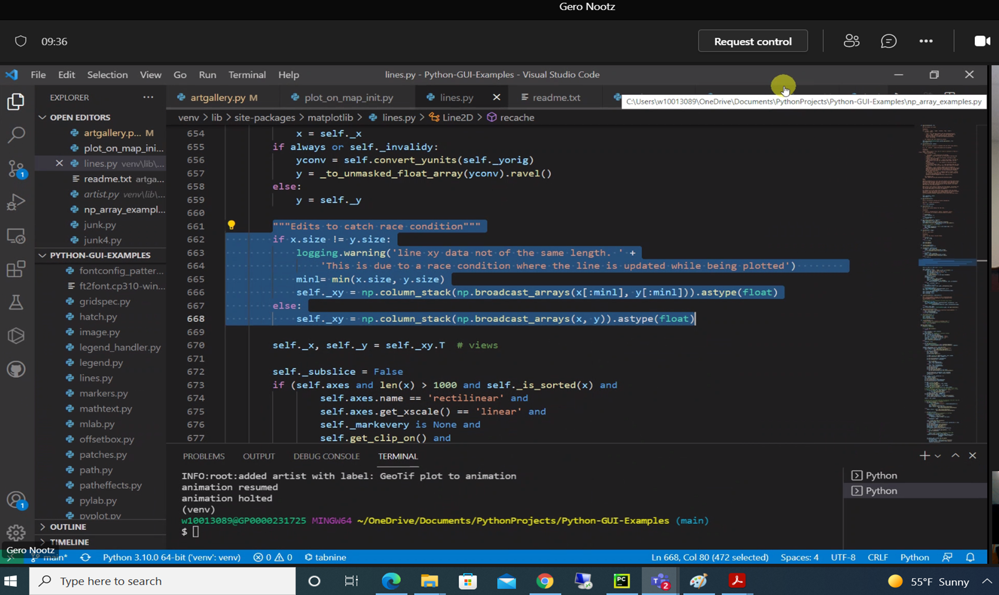

#Fastest way to read a binary file with a defined format
https://stackoverflow.com/questions/44933639/fastest-way-to-read-a-binary-file-with-a-defined-format

#github Tutorial
https://www.youtube.com/watch?v=RGOj5yH7evk

#kalman filter
https://filterpy.readthedocs.io/en/latest/index.html#id6
https://github.com/rlabbe/Kalman-and-Bayesian-Filters-in-Python

# python tkinter GUI
Having frames next to each other in Tkinter
https://stackoverflow.com/questions/45122244/having-frames-next-to-each-other-in-tkinter
https://web.archive.org/web/20200315112731/http://effbot.org/tkinterbook/
https://www.youtube.com/watch?v=SYbfBajIsSw&list=PLXlKT56RD3kBUYQiG_jrAMOtm_SfPLvwR&index=11

# Unofficial Windows Binaries for Python Extension Packages
https://www.lfd.uci.edu/~gohlke/pythonlibs/

# How do I install a .whl file in a PyCharm virtualenv?
https://stackoverflow.com/questions/39791243/how-do-i-install-a-whl-file-in-a-pycharm-virtualenv

To install via your command line, and avoid installing on your base Python, you'll have to first activate the virtualenv.

You can do this on POSIX using:

$ source path_to_your_venv/bin/activate
And then for Windows systems:

> path_to_venv\Scripts\activate
You can then install the .whl file with pip install filename.whl while the virtual env has been activated.

For Pycharm venv's the path is 'path_to_venv/Scripts/activate.bat – 
Awebb
 Sep 30 '16 at 12:36 

# 201 - Working with geotiff files using rasterio in python (also quick demo of NDVI calculation)
https://www.youtube.com/watch?v=ieyODuIjXp4

# You can remove NaNs using a mask:
https://stackoverflow.com/questions/13643363/linear-regression-of-arrays-containing-nans-in-python-numpy
mask = ~np.isnan(varx) & ~np.isnan(vary)
slope, intercept, r_value, p_value, std_err = stats.linregress(varx[mask], vary[mask])

# Class
https://www.youtube.com/watch?v=E7vUSmNktJM&list=PLXlKT56RD3kBMTZfn3lYjR_krGkHM9emv&index=2

# Matplotlib Animation
https://towardsdatascience.com/animations-with-matplotlib-d96375c5442c

# python instance object life cycle 
https://betterprogramming.pub/the-life-cycle-of-python-instance-objects-4a719fb4e925

#  Python library for real and complex floating-point arithmetic with arbitrary precision
https://mpmath.org/

# Corey Schafer: Matplotlib Tutorial (Part 9): Plotting Live Data in Real-Time
https://www.youtube.com/watch?v=Ercd-Ip5PfQ

# Line of best fit (Linear regression) over vertical line
https://stats.stackexchange.com/questions/57685/line-of-best-fit-linear-regression-over-vertical-line

# Line of best fit (Linear regression) over vertical line
https://stats.stackexchange.com/questions/57685/line-of-best-fit-linear-regression-over-vertical-line

# Python style guide PEP-8
https://www.python.org/dev/peps/pep-0008/

#LSTM time series prediction: sine wave example
https://www.kaggle.com/carlmcbrideellis/lstm-time-series-prediction-sine-wave-example

# How to Kill a Python Thread
https://blog.miguelgrinberg.com/post/how-to-kill-a-python-thread

# Import Modules From Another Folder
https://blog.finxter.com/python-how-to-import-modules-from-another-folder/

# [y for x in range(3) for y in [x, x]]; [0, 0, 1, 1, 2, 2]

# NMEA 
http://aprs.gids.nl/nmea/#rmc

# TensorFlow 2.0 Complete Course - Python Neural Networks for Beginners Tutorial
https://www.youtube.com/watch?v=tPYj3fFJGjk

# EDIT MATLPLOTLIB
"""Edits to catch race condition"""
        if x.size != y.size:
            logging.warning('line xy data not of the same length. ' +
                'This is due to a race condition where the line is updated while being plotted')
            minl= min(x.size, y.size)
            self._xy = np.column_stack(np.broadcast_arrays(x[:minl], y[:minl])).astype(float)
        else:
            self._xy = np.column_stack(np.broadcast_arrays(x, y)).astype(float)

IVER 3
https://www.environmental-expert.com/products/model-iver3-open-system-autonomous-underwater-vehicles-auvs-606524

#GIT
https://www.youtube.com/watch?v=6vvUevxlOp8

# Thread inheritance
https://stackoverflow.com/questions/32382793/inheritance-threading-thread-class-does-not-work

#ML
https://machinelearningmastery.com/start-here/